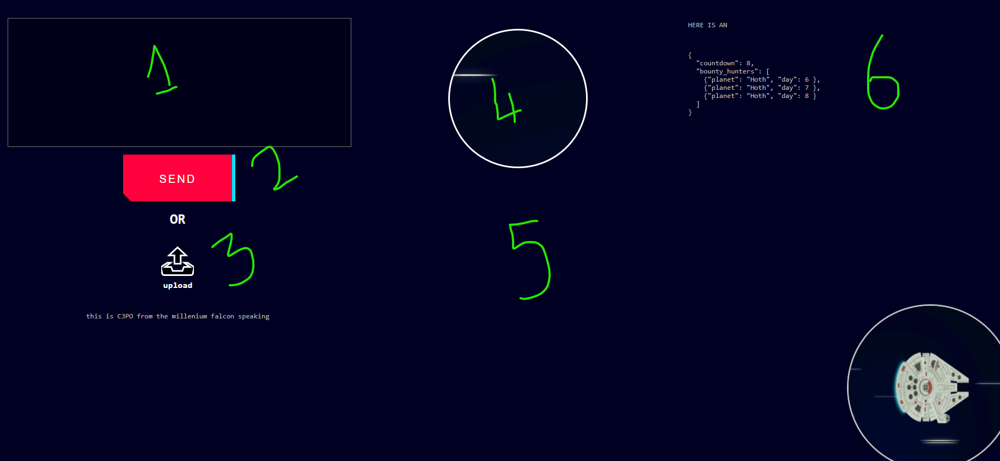
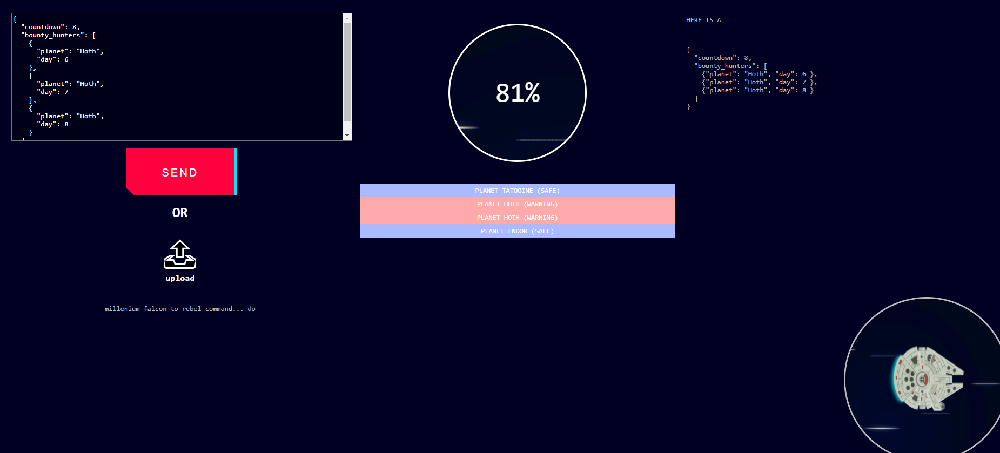

# README

## requirements :
 
- node (version >= 14.4.0)
- npm (version >= 6.14.5)

<br>
<br>

## before running...

run the following command

```
$ npm i 
```

<br>
<br>

## running the tests :

```
$ npm run test 
```

<br>
<br>

## running the web app :

the following command should run the web server AND open your browser
```
$ npm run start::web
```

if the command above doesn't work (hasn't properly been tested in a non window environment), run the following
```
$ npm run start::serve
```
then access to the url http://localhost:3000/

<br>
<br>

## using the web app

  
  - either...
    - write your empire json data in the input (1) AND push the send button (2)
    - OR use the upload button  to select a file on your computer (3)
  - the odds and the travel plan should appear (4 & 5)
  - on the right (6) there is an example of json input that can be copied 


<br>
<br>

## running the cli :
there are 3 script to run the cli tool depending on your command prompt
### powershell :
```
$ give-me-the-odds.ps1 ./config/millennium-falcon.json ./examples/empire.json
```
### CMD :
```
$ give-me-the-odds.bat ./config/millennium-falcon.json ./examples/empire.json
```
### bash :
```
$ give-me-the-odds.sh ./config/millennium-falcon.json ./examples/empire.json
```